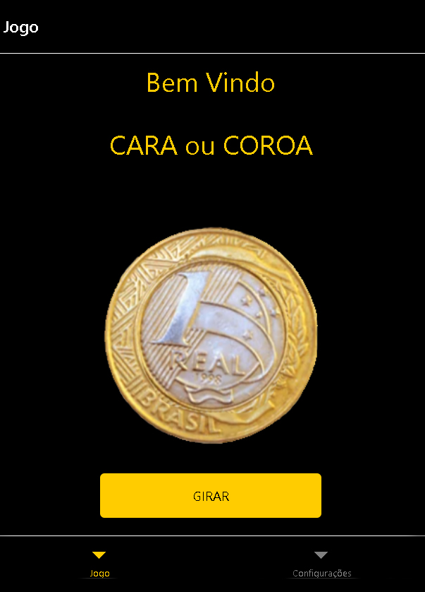
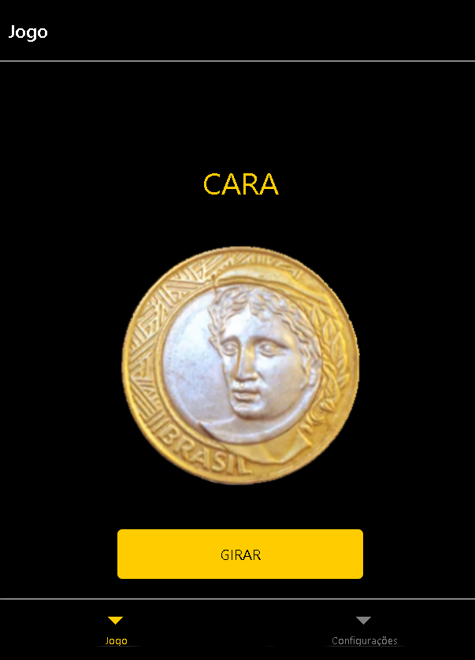
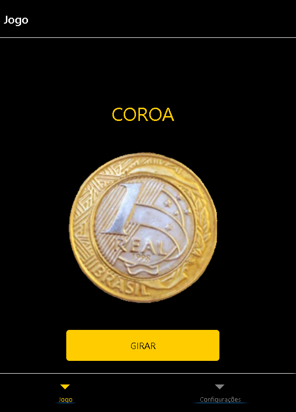
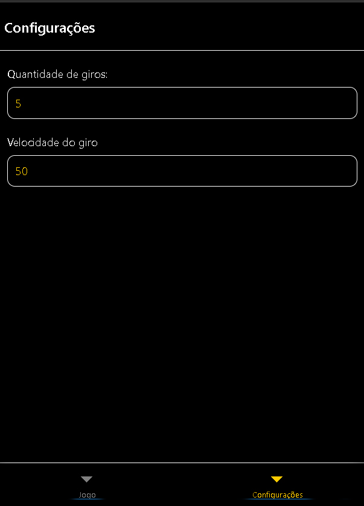

<h1 align="center"> 
  Aplicativo - Cara ou Coroa
</h1>

## Projeto

 

O projeto desenvolvido foi um jogo de <em>Cara ou Coroa </em> , que permite que o usuário dispute com outro adversário uma partida, para saber quem é o ganhador. O aplicativo foi desenvolvido apenas para praticar e exercitar o uso do React Native e do Photoshop.

 

### O que é?
 

Cara ou Coroa é um jogo simples, que consiste em se atirar uma moeda ao ar para então verificar qual de seus lados ficou voltado para cima após sua queda. É comumente utilizado para se escolher entre duas alternativas ou para resolver uma disputa entre duas partes. Wikipédia

 

### Funcionalidades

+ Jogar  
+ Configurações:      
  * Velocidade do giro da moeda 
  * Quantidade de giros da moeda
  
 

### Tecnologias 

Esse projeto foi desenvolvido utilizando:

-  [React Native](https://reactnative.dev/);
-  [React Navigation](https://reactnavigation.org/)
-  [Photoshop](https://www.adobe.com/br/products/photoshop.html)
 

### License
Esse projeto está sob MIT license. Veja [LICENSE](https://github.com/belapferreira/conceitos-react-native/blob/master/LICENSE) para mais informações.

 

<h3 align="center"> Imagem do App </h3> 

 
 

 

 
 

 

 
 

 

 

---
<h3 align="center">
 Feito por Márcio Ramos Medeiros - 2022
 </h3>

